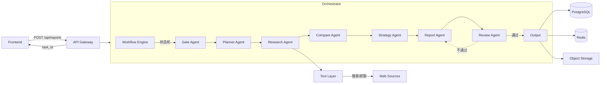

# AI 竞品分析助手 — Architecture Design Review

> 基于文档：产品定位.docx、PRD文档.docx、竞品分析报告模板.md、Agent Specification MD 文件、Agentflow.docx、techDesign.md、workflow.md

---

## 0. 关键发现（Design Issues Found）

在评审过程中，发现以下需要优先修复的设计问题：

### ❌ Issue 1：三种 Workflow 彼此矛盾

文档中存在三套不同的 Agent 执行流程：

| 来源 | Workflow | 问题 |
|------|----------|------|
| `Agent Specification/*.md` | Planner → Research → Compare → **Strategy** → Report → **Review** | 规范版，但 workflow.md 未对齐 |
| `workflow.md` | Planner → Research → **Competitor** → **Framework** → **Reviewer** → Report | 缺少 Strategy Agent，多了未定义的 Framework Agent |
| `Agentflow.docx`（图表） | Planner → Research → **Competitor** → **Framework** → **Reviewer** → Report | 同 workflow.md，图表与文档自相矛盾 |
| `Agentflow.docx`（表格） | Planner → Research → **Comparator** → **Strategy** → **Writer** | 又一套命名体系 |

**结论**：必须统一为一套 Workflow。下面的架构部分使用规范版（planner.md → review.md）。

### ❌ Issue 2：「Framework Agent」不存在

`workflow.md` 和 `Agentflow.docx` 中出现了 **Framework Agent（根据模板组织内容）**，但 Agent Specification 目录中没有任何对应文件。其职责与 Compare Agent、Report Agent 重叠。

### ❌ Issue 3：Review Agent 位置矛盾

- Agent Specification 文件：Review Agent 在 **Report Agent 之后**（检查最终输出）
- workflow.md / Agentflow.docx：Reviewer Agent 在 **Report Agent 之前**（报告生成前检查）

**分析**：两种位置都有价值，但需要明确分别设计为 **Gate Review（生成前检查）** 和 **Quality Review（生成后检查）**，而不是用一个 Agent 做两件事。

### ❌ Issue 4：Strategy Agent 在 workflow.md 中被遗漏

`strategy.md` 是完整定义的 Agent，负责 SWOT、机会、风险和 Roadmap，但在 `workflow.md` 的流程图中被 **Framework Agent** 替代。Framework Agent 不存在，Strategy Agent 的职责无人承接。

### ❌ Issue 5：缺少跨 Agent 的错误处理与重试机制

没有任何文档定义以下场景：

- Research Agent 搜索失败怎么办（重试？降级？终止？）
- LLM 调用超时怎么办
- Agent 间数据传递丢失怎么办
- 用户取消任务怎么回滚（PRD 提到"取消返回首页"但无架构方案）

### ❌ Issue 6：缺少数据质量与来源管理

输入的数据源种类多（官网、App Store、知乎、小红书、AI 搜索等），但：

- 没有针对数据来源的可信度评分机制
- 没有数据去重后的一致性检查
- 没有跨来源的交叉验证

### ❌ Issue 7：Compare Agent 的职责需要给定位

`compare.md` 规定不能给建议、不能 SWOT，但 Strategy Agent 的工作建立在 Compare 的结果之上。中间的接口契约（Contract）没有明确定义。

---

## 1. 产品目标分析

### 1.1 核心理念

```
输入：竞品公司 + 产品名称 + 分析目标
流程：自动采集 → 自动分析 → 自动生成报告
输出：结构化竞品分析报告（Markdown + Word）
约束：3分钟内完成
```

### 1.2 用户画像

- 产品经理、产品实习生、产品负责人

### 1.3 核心价值

将「找资料 → 看官网 → 看 App → 整理 Excel → 写 PPT」的 **3~5 小时** 手动流程压缩为 **10 分钟** 自动化流程。

### 1.4 数据来源域

```
可抓取：官网 | App Store | Google Play | 知乎 | 小红书 | 公众号 | 新闻 | GitHub | AI 搜索
禁止：需要登录 | 收费数据 | 违法抓取的网站
```

### 1.5 版本范围

**V1**：仅竞品分析模块。仅支持 1 对 1 竞品分析（我方 vs 竞品）。
**V2+**（规划）：简历匹配评估、面试模拟、期望入职公司分析。

---

## 2. Agent Workflow Review 与修正

### 2.1 现有问题总结

```
规范文件定义：Planner → Research → Compare → Strategy → Report → Review
workflow.md 定义：Planner → Research → Competitor → Framework → Reviewer → Report
Agentflow.docx 图表：同 workflow.md
Agentflow.docx 表格：Planner → Research → Comparator → Strategy → Writer
```

### 2.2 推荐 Workflow（修正后）

```
                     ┌─────────────────────────────────────┐
                     │          User Input (Frontend)       │
                     │   our_company + competitor + product  │
                     │   + objective + optional context      │
                     └──────────────┬──────────────────────┘
                                    │
                     ┌──────────────▼──────────────────────┐
                     │           Gate Agent                 │ ◄── 新增
                     │   Input Validation + Schema Check    │
                     │   分析目标合法性 + 参数完整性         │
                     └──────────────┬──────────────────────┘
                                    │
                     ┌──────────────▼──────────────────────┐
                     │          Planner Agent               │
                     │   理解任务 → 拆解维度 → 制定计划      │
                     │   输出 Research Plan                 │
                     └──────────────┬──────────────────────┘
                                    │
                     ┌──────────────▼──────────────────────┐
                     │          Research Agent              │
                     │   多源搜索 → 证据收集 → 可信度评分    │
                     │   输出标准化 Evidence Bundle          │
                     │   ◄ 内置重试 + 超时降级               │
                     └──────────────┬──────────────────────┘
                                    │
                     ┌──────────────▼──────────────────────┐
                     │          Compare Agent                │
                     │   Research 输出 → 按维度对比          │
                     │   定位 / 用户 / 功能 / 商业模式       │
                     │   / 增长 / AI 能力 → 差异矩阵        │
                     │   输出 Gap Analysis                  │
                     └──────────────┬──────────────────────┘
                                    │
                     ┌──────────────▼──────────────────────┐
                     │          Strategy Agent               │
                     │   Gap Analysis → SWOT → 机会 → 风险  │
                     │   → 产品建议 → Roadmap               │
                     │   输出 Strategic Insights             │
                     └──────────────┬──────────────────────┘
                                    │
                     ┌──────────────▼──────────────────────┐
                     │          Report Agent                 │
                     │   聚合 Compare + Strategy + Research  │
                     │   → 按模板组装 Markdown / HTML       │
                     │   → 导出 Word                        │
                     └──────────────┬──────────────────────┘
                                    │
                     ┌──────────────▼──────────────────────┐
                     │          Review Agent                 │
                     │   完整性检查 + 逻辑校验 + 引用核查    │
                     │   + 重复检测 + 格式检查              │
                     │   失败 → 反馈 Report Agent 修订       │
                     └──────────────┬──────────────────────┘
                                    │
                     ┌──────────────▼──────────────────────┐
                     │          Output                       │
                     │   Markdown / Word / HTML             │
                     │   存储到 DB → 返回 Frontend          │
                     └─────────────────────────────────────┘
```

### 2.3 修正要点

1. **新增 Gate Agent** — 输入校验层，防止无效请求进入 LLM 管线
2. **删除 Framework Agent** — 不存在且职责与 Report Agent 重叠
3. **统一命名** — Competitor → Compare，Reviewer → Review
4. **Review Agent 后置** — 生成后检查，并支持向 Report Agent 反馈修订
5. **Report Agent 承担模板组织** — 吸收 Framework Agent 的合理职责
6. **所有 Agent 内置 Error Boundary** — 失败时上层 Orchestrator 处理

---

## 3. Agent 职责矩阵

| Agent | 核心职责 | 不可做 | 输出 |
|-------|----------|--------|------|
| **Gate** | 输入校验、Schema 验证、安全检查 | 不能调用 LLM | ValidationResult |
| **Planner** | 理解目标、拆解维度、生成 Research Plan | 不能搜索、不能分析、不能推测 | ResearchPlan |
| **Research** | 多源采集、证据整理、可信度评分 | 不能分析、不能推测、不能下结论 | EvidenceBundle |
| **Compare** | 按维度对比、识别差距、输出差异矩阵 | 不能给建议、不能 SWOT、不能输出 Roadmap | GapAnalysis |
| **Strategy** | SWOT、机会识别、风险分析、产品建议 | 不能编造数据、无证据不下结论 | StrategicInsights |
| **Report** | 聚合数据、按模板组装、多格式生成 | 不能修改分析结果、不能新增观点 | ReportDocument |
| **Review** | 完整性/逻辑/引用/重复/格式检查 | 不能修改正文、仅输出审核结果 | ReviewResult |

### 3.1 职责重叠检测

| 潜在重叠 | 分析 | 结论 |
|----------|------|------|
| Compare ↔ Strategy | Compare 输出差异 → Strategy 基于差异做分析 | 天然上下游，Contract 清晰，**无重叠** |
| Report ↔ Framework (已删除) | Framework 不存在，Report 承接模板组装 | **已修复** |
| Report ↔ Review | Report 生成 → Review 检查，不修改 | **无重叠** |
| Planner ↔ Gate | Gate 只做校验，Planner 做任务拆解 | **无重叠** |
| Research ↩ 多源管理 | Research 内部需要子任务管理搜索源 | 建议 Research Agent 内部做子 Agent 拆分 |

### 3.2 职责遗漏检测

| 缺失职责 | 影响 | 建议 |
|----------|------|------|
| 错误恢复 Orchestrator | 单 Agent 失败 → 整体流程中断 | 引入 **AgentOrchestrator** 层（见架构图） |
| 进度管理 | PRD 要求"分析进度"展示 | Orchestrator 统一管理状态机 |
| 缓存/历史查询 | PRD 要求"历史记录" | 引入 **History Manager** |
| 数据源健康检查 | 数据源可能不可用 | Research Agent 内部实现 |

---

## 4. 整体系统架构（Architecture）

```
┌──────────────────────────────────────────────────────────────────────┐
│                        Frontend (Next.js)                            │
│   ┌─────────┐    ┌──────────────┐    ┌──────────────┐              │
│   │ 首页     │    │ 分析过程页   │    │ 报告详情页   │              │
│   │ (输入页) │───▶│ (进度展示)   │───▶│ (展示/导出)  │              │
│   └─────────┘    └──────────────┘    └──────────────┘              │
│         │                                                        │
│         │ POST /api/reports                                        │
│         │ GET  /api/reports/:id/progress                            │
│         │ GET  /api/reports/:id                                    │
└─────────┼────────────────────────────────────────────────────────┘
          │
┌─────────▼────────────────────────────────────────────────────────┐
│                     API Gateway Layer                              │
│   ┌────────────────────────────────────────────────────────────┐  │
│   │   FastAPI / Next.js API Routes                              │  │
│   │   • 输入校验 (Pydantic) → 返回 400                        │  │
│   │   • 创建分析任务 → 返回 task_id                           │  │
│   │   • 查询进度 → 返回 Progress                               │  │
│   │   • 获取报告 → 返回 Report                                  │  │
│   └───────────────────────────┬────────────────────────────────┘  │
└───────────────────────────────┼────────────────────────────────────┘
                                │
┌───────────────────────────────▼────────────────────────────────────┐
│                     Agent Orchestrator Core                         │
│                                                                     │
│   ┌──────────────────────────────────────────────────────────────┐  │
│   │                     Workflow Engine                           │  │
│   │  State Machine: PENDING → RUNNING → COMPLETED / FAILED      │  │
│   │  • 任务队列 (Async Queue)                                    │  │
│   │  • 进度管理 (Progress Tracker)                               │  │
│   │  • 错误恢复 (Retry + Fallback + Circuit Breaker)             │  │
│   │  • Agent 心跳 (Heartbeat)                                    │  │
│   │  • 超时管理 (Timeout: 整个流程 < 5min)                       │  │
│   └──────┬──────────┬──────────┬──────────┬──────────┬──────────┘  │
│          │          │          │          │          │             │
│   ┌──────▼──┐ ┌────▼───┐ ┌───▼───┐ ┌───▼────┐ ┌───▼──────┐      │
│   │  Gate   │ │Planner │ │Research│ │Compare │ │ Strategy │      │
│   │  Agent  │ │ Agent  │ │ Agent  │ │ Agent  │ │  Agent   │      │
│   └─────────┘ └────────┘ └───┬────┘ └───┬────┘ └───┬──────┘      │
│                               │           │          │             │
│                        ┌──────▼────┐ ┌───▼────┐ ┌──▼──────┐      │
│                        │Research   │ │Compare │ │Strategy  │      │
│                        │子任务      │ │审核    │ │审核      │      │
│                        └───────────┘ └────────┘ └─────────┘      │
│                                                                     │
│   ┌──────────────┐    ┌──────────────┐    ┌──────────────┐        │
│   │ Report Agent  │───▶│ Review Agent │───▶│  Output      │        │
│   │ (模板组装)    │    │ (质量检查)    │    │  格式化      │        │
│   └──────────────┘    └──────┬───────┘    └──────────────┘        │
│                              │                                      │
│                   失败退回 → Report Agent 重试                      │
│                                                                     │
└───────────────────────────────┼────────────────────────────────────┘
                                │
┌───────────────────────────────▼────────────────────────────────────┐
│                       Tool Layer                                    │
│                                                                     │
│   ┌────────────┐ ┌───────────┐ ┌──────────┐ ┌──────────────────┐  │
│   │ Web Search │ │ Web       │ │ App Store│ │ AI Search        │  │
│   │ (Bing/GG)  │ │ Scraper   │ │ Scraper  │ │ (Perplexity/...) │  │
│   └────────────┘ └───────────┘ └──────────┘ └──────────────────┘  │
│   ┌────────────┐ ┌───────────┐ ┌──────────┐ ┌──────────────────┐  │
│   │ Social     │ │ News API  │ │ GitHub   │ │ LLM (GPT-4o /    │  │
│   │ Scraper    │ │           │ │ Scraper   │ │ Claude)         │  │
│   └────────────┘ └───────────┘ └──────────┘ └──────────────────┘  │
│                                                                     │
└───────────────────────────────┼────────────────────────────────────┘
                                │
┌───────────────────────────────▼────────────────────────────────────┐
│                        Data Layer                                   │
│                                                                     │
│   ┌──────────────────────────────────────────────────────────────┐  │
│   │                          PostgreSQL                           │  │
│   │  ┌────────────┐ ┌────────────────┐ ┌──────────────────────┐  │  │
│   │  │ reports    │ │ tasks          │ │ evidence_cache       │  │  │
│   │  │ (报告主表) │ │ (任务进度表)    │ │ (搜索缓存)           │  │  │
│   │  ├────────────┤ ├────────────────┤ ├──────────────────────┤  │  │
│   │  │ report_    │ │ agent_results  │ │ source_quality       │  │  │
│   │  │ versions   │ │ (Agent结果快照) │ │ (数据源质量评分)     │  │  │
│   │  └────────────┘ └────────────────┘ └──────────────────────┘  │  │
│   └──────────────────────────────────────────────────────────────┘  │
│                                                                     │
│   ┌──────────────────────────────────────────────────────────────┐  │
│   │                     Redis (Cache + Queue)                     │  │
│   │  • 任务队列 (Bull/Task Queue)                                │  │
│   │  • 进度缓存 (Progress Cache)                                 │  │
│   │  • 搜索缓存 (Search Cache, TTL=1h)                          │  │
│   │  • Rate Limiter (Token Bucket)                               │  │
│   └──────────────────────────────────────────────────────────────┘  │
│                                                                     │
│   ┌──────────────────────────────────────────────────────────────┐  │
│   │                     Object Storage (S3/MinIO)                 │  │
│   │  • Word 导出文件 (word_output/{report_id}.docx)             │  │
│   │  • 原始搜索截图 (screenshots/{task_id}/)                    │  │
│   │  • 历史报告归档 (archives/{date}/)                          │  │
│   └──────────────────────────────────────────────────────────────┘  │
│                                                                     │
└─────────────────────────────────────────────────────────────────────┘
```

---

## 5. 推荐目录结构

```
competitive-analysis/
├── frontend/                          # Next.js 前端应用
│   ├── src/
│   │   ├── pages/
│   │   │   ├── index.tsx              # 首页（输入页）
│   │   │   ├── tasks/
│   │   │   │   └── [id].tsx           # 分析过程页
│   │   │   ├── reports/
│   │   │   │   └── [id].tsx           # 报告详情页
│   │   │   └── history.tsx            # 历史记录页
│   │   ├── components/
│   │   │   ├── ReportViewer.tsx       # 报告渲染组件
│   │   │   ├── ProgressIndicator.tsx  # 进度指示组件
│   │   │   └── InputForm.tsx          # 输入表单
│   │   ├── hooks/
│   │   │   ├── useTaskProgress.ts     # 轮询进度 Hook
│   │   │   └── useReport.ts          # 获取报告 Hook
│   │   ├── services/
│   │   │   └── api.ts                 # API 调用层
│   │   └── types/
│   │       └── index.ts               # TS 类型定义
│   ├── package.json
│   └── tsconfig.json
│
├── backend/                           # Python 后端
│   ├── api/                           # API 层
│   │   ├── __init__.py
│   │   ├── main.py                    # FastAPI 入口
│   │   ├── routes/
│   │   │   ├── reports.py             # 报告 CRUD
│   │   │   ├── tasks.py               # 任务进度
│   │   │   └── health.py              # 健康检查
│   │   └── schemas/
│   │       ├── report.py              # 报告 Schema
│   │       ├── task.py                # 任务 Schema
│   │       └── agent.py               # Agent I/O Schema
│   │
│   ├── core/                          # 核心引擎
│   │   ├── orchestrator/              # Agent 编排
│   │   │   ├── __init__.py
│   │   │   ├── workflow_engine.py     # 状态机引擎
│   │   │   ├── task_queue.py          # 任务队列
│   │   │   ├── progress_tracker.py    # 进度追踪
│   │   │   └── error_handler.py       # 错误恢复
│   │   ├── agents/                    # Agent 实现
│   │   │   ├── base.py                # Base Agent 抽象
│   │   │   ├── gate_agent.py          # 输入校验
│   │   │   ├── planner_agent.py       # 任务规划
│   │   │   ├── research_agent.py      # 信息采集
│   │   │   ├── compare_agent.py       # 差异分析
│   │   │   ├── strategy_agent.py      # 战略分析
│   │   │   ├── report_agent.py        # 报告生成
│   │   │   └── review_agent.py        # 质量审查
│   │   └── llm/                       # LLM 调用层
│   │       ├── __init__.py
│   │       ├── client.py              # LLM 客户端封装
│   │       ├── prompt_templates.py    # Prompt 模板
│   │       └── response_parser.py     # 结构化输出解析
│   │
│   ├── tools/                         # Tool 层
│   │   ├── search/                    # 搜索工具
│   │   │   ├── web_search.py          # Bing/Google Search
│   │   │   ├── web_scraper.py         # 网页抓取
│   │   │   ├── app_store_scraper.py   # App Store
│   │   │   ├── social_scraper.py      # 知乎/小红书
│   │   │   └── ai_search.py           # Perplexity 等 AI 搜索
│   │   ├── parsers/                   # 解析器
│   │   │   ├── html_parser.py         # HTML → Markdown
│   │   │   └── review_parser.py       # 评论解析
│   │   └── exporters/                 # 导出工具
│   │       ├── markdown_exporter.py   # MD 导出
│   │       └── word_exporter.py       # Word 导出
│   │
│   ├── models/                        # 数据模型
│   │   ├── report.py                  # 报告模型
│   │   ├── task.py                    # 任务模型
│   │   ├── evidence.py                # 证据模型
│   │   └── cache.py                   # 缓存模型
│   │
│   ├── db/                            # 数据库层
│   │   ├── session.py                 # DB Session
│   │   ├── migrations/                # Alembic 迁移
│   │   └── repositories/             # DAO 层
│   │       ├── report_repo.py
│   │       ├── task_repo.py
│   │       └── cache_repo.py
│   │
│   ├── config/                        # 配置
│   │   ├── settings.py                # 全局配置
│   │   └── agent_config.py            # Agent 级配置
│   │
│   ├── tests/                         # 测试
│   │   ├── test_orchestrator/
│   │   ├── test_agents/
│   │   └── test_tools/
│   │
│   ├── requirements.txt
│   └── Dockerfile
│
├── infrastructure/
│   ├── docker-compose.yml             # 本地开发环境
│   ├── nginx/
│   │   └── default.conf
│   └── kubernetes/                    # 生产部署
│       ├── deployment.yaml
│       └── service.yaml
│
├── docs/                              # 文档
│   ├── architecture.md                # 本文档
│   ├── agent-specs/                   # Agent 规范
│   │   ├── gate-agent.md
│   │   ├── planner-agent.md
│   │   ├── research-agent.md
│   │   ├── compare-agent.md
│   │   ├── strategy-agent.md
│   │   ├── report-agent.md
│   │   └── review-agent.md
│   └── data-flow.md                   # 数据流文档
│
├── templates/                         # 报告模板
│   ├── competitive-analysis/
│   │   ├── template_v1.json           # 模板配置
│   │   └── sections/                  # 各章节模板
│   └── word-template.docx             # Word 格式模板
│
├── Makefile
└── README.md
```

---

## 6. 推荐数据流

### 6.1 整体数据流

```
[Frontend]
    │ POST /api/reports { our_company, competitor, product, objective }
    ▼
[API Gateway]
    │ Validates input → 返回 { task_id, status: "pending" }
    ▼
[Orchestrator]
    │ 创建 task 记录 → push 到 Task Queue → 返回 task_id
    ▼
[Workflow Engine] (异步)
    │
    ├─ 1. Gate Agent ──→ ValidationResult
    │   └─ 失败 → status: "invalid_input" → 通知 Frontend
    │
    ├─ 2. Planner Agent ──→ ResearchPlan { objective, analysis_scope, research_tasks }
    │
    ├─ 3. Research Agent ──→ EvidenceBundle
    │   ├─ 子任务 1: Web Search (Bing/Google)
    │   ├─ 子任务 2: Web Scrape (官网/知乎/小红书)
    │   ├─ 子任务 3: App Store Scrape
    │   ├─ 子任务 4: AI Search (Perplexity)
    │   └─ 最终：去重 + 可信度评分 + 结构化输出
    │
    ├─ 4. Compare Agent ──→ GapAnalysis
    │   ├─ 产品定位对比
    │   ├─ 功能矩阵对比
    │   ├─ 用户画像对比
    │   ├─ 商业模式对比
    │   ├─ 增长策略对比
    │   └─ AI 能力对比
    │
    ├─ 5. Strategy Agent ──→ StrategicInsights
    │   ├─ SWOT 分析
    │   ├─ 机会识别
    │   ├─ 风险评估
    │   ├─ 产品建议
    │   └─ Roadmap
    │
    ├─ 6. Report Agent ──→ ReportDocument
    │   ├─ 聚合所有中间结果
    │   ├─ 按模板组装各章节
    │   ├─ 生成 Markdown / HTML
    │   └─ 导出 Word
    │
    └─ 7. Review Agent ──→ ReviewResult
        ├─ 完整性检查 → 不通过 → 退回 Report Agent 修订
        ├─ 逻辑检查
        ├─ 引用来源检查
        └─ 评分 → status: "completed"
    │
    ▼
[DB]
    │ 存储最终报告 + Agent 中间结果快照
    ▼
[Frontend]
    │ GET /api/reports/:id → 展示报告
    │ GET /api/reports/:id/export/word → 下载 Word
```

### 6.2 进度状态机

```
PENDING → VALIDATING → PLANNING → RESEARCHING → COMPARING
  → STRATEGIZING → REPORTING → REVIEWING → COMPLETED
                                              ↓
                                          FAILED
                                              ↓
                                        REVIEW_FAILED
                                        (退回 REPORTING)

支持用户取消：任何状态 → CANCELLED
支持重试：FAILED → 重新提交到 QUEUE（上限 3 次）
```

---

## 7. 每个 Agent 的输入输出 Schema (JSON Schema)

### 7.1 Gate Agent

```json
{
  "input_schema": {
    "type": "object",
    "required": ["our_company", "competitor_company", "product", "objective"],
    "properties": {
      "our_company":     { "type": "string", "minLength": 1, "description": "我方公司名称" },
      "competitor_company": { "type": "string", "minLength": 1, "description": "竞品公司名称" },
      "product":         { "type": "string", "minLength": 1, "description": "比对产品名称" },
      "objective": {
        "type": "string",
        "enum": ["product_improvement", "go_to_market", "investment_due_diligence",
                 "competitive_defense", "positioning_switch", "partnership_evaluation",
                 "feature_benchmark"]
      },
      "optional": {
        "type": "object",
        "properties": {
          "industry":       { "type": "string" },
          "region":         { "type": "string" },
          "product_type":   { "type": "string", "enum": ["B2C", "B2B", "Platform", "Tool", "Content", "AI_Native"] },
          "product_stage":  { "type": "string", "enum": ["exploration", "growth", "maturity"] },
          "additional_context": { "type": "string" }
        }
      }
    }
  },
  "output_schema": {
    "type": "object",
    "required": ["is_valid", "validated_input", "issues"],
    "properties": {
      "is_valid":        { "type": "boolean" },
      "validated_input": { "$ref": "input_schema" },
      "issues": {
        "type": "array",
        "items": {
          "type": "object",
          "properties": {
            "field":    { "type": "string" },
            "message":  { "type": "string" },
            "severity": { "type": "string", "enum": ["error", "warning"] }
          }
        }
      },
      "task_id": { "type": "string", "format": "uuid" }
    }
  }
}
```

### 7.2 Planner Agent

```json
{
  "input_schema": {
    "type": "object",
    "required": ["our_company", "competitor_company", "product", "objective", "validated_input"],
    "properties": {
      "our_company":       { "type": "string" },
      "competitor_company":{ "type": "string" },
      "product":           { "type": "string" },
      "objective":         { "type": "string" },
      "optional":          { "type": "object" }
    }
  },
  "output_schema": {
    "type": "object",
    "required": ["objective", "analysis_scope", "research_tasks", "required_sources", "workflow"],
    "properties": {
      "objective":       { "type": "string" },
      "analysis_scope":  {
        "type": "array",
        "items": {
          "type": "string",
          "enum": ["positioning", "users", "features", "ux", "business",
                   "technology", "growth", "competitive_landscape",
                   "risks", "strategy"]
        },
        "minItems": 1
      },
      "research_tasks": {
        "type": "array",
        "items": {
          "type": "object",
          "required": ["task_id", "source_type", "keywords", "priority"],
          "properties": {
            "task_id":       { "type": "string" },
            "source_type":   { "type": "string", "enum": ["web", "app_store", "social", "news", "github", "ai_search"] },
            "keywords":      { "type": "array", "items": { "type": "string" } },
            "priority":      { "type": "integer", "minimum": 1, "maximum": 5 },
            "dependencies":  { "type": "array", "items": { "type": "string" } }
          }
        }
      },
      "required_sources": {
        "type": "array",
        "items": { "type": "string" }
      },
      "workflow": {
        "type": "array",
        "items": { "type": "string" },
        "description": "Agent 执行顺序"
      },
      "estimated_complexity": {
        "type": "string",
        "enum": ["simple", "moderate", "complex"]
      }
    }
  }
}
```

### 7.3 Research Agent

```json
{
  "input_schema": {
    "type": "object",
    "required": ["research_plan"],
    "properties": {
      "research_plan": { "$ref": "planner_output" }
    }
  },
  "output_schema": {
    "type": "object",
    "required": ["company", "product", "evidence_items", "sources_used", "references", "quality_score"],
    "properties": {
      "company": {
        "type": "object",
        "properties": {
          "our_company": {
            "type": "object",
            "properties": {
              "description":        { "type": "string" },
              "positioning":        { "type": "string" },
              "business_model":     { "type": "string" },
              "market_focus":       { "type": "string" },
              "funding_stage":      { "type": "string" },
              "data_quality":       { "type": "string", "enum": ["high", "medium", "low", "no_data"] }
            }
          },
          "competitor_company": { "same_schema_as_our_company": true }
        }
      },
      "product": {
        "type": "object",
        "properties": {
          "our_product": {
            "type": "object",
            "properties": {
              "name":              { "type": "string" },
              "category":          { "type": "string" },
              "description":       { "type": "string" },
              "key_features":      { "type": "array", "items": { "type": "string" } },
              "target_users":      { "type": "string" },
              "platforms":         { "type": "array", "items": { "type": "string" } },
              "pricing":           { "type": "string" },
              "data_quality":      { "type": "string", "enum": ["high", "medium", "low", "no_data"] }
            }
          },
          "competitor_product": { "same_schema": true }
        }
      },
      "evidence_items": {
        "type": "array",
        "items": {
          "type": "object",
          "required": ["source", "content", "confidence", "category"],
          "properties": {
            "source":       { "type": "string", "description": "URL 或来源名称" },
            "content":      { "type": "string" },
            "confidence":   { "type": "string", "enum": ["verified", "likely", "estimated", "speculative"] },
            "category":     { "type": "string" },
            "extracted_at": { "type": "string", "format": "date-time" },
            "raw_data":     { "type": "object" }
          }
        }
      },
      "news": {
        "type": "array",
        "items": {
          "type": "object",
          "properties": {
            "title":        { "type": "string" },
            "source":       { "type": "string" },
            "date":         { "type": "string", "format": "date" },
            "summary":      { "type": "string" },
            "url":          { "type": "string" },
            "relevance":    { "type": "string", "enum": ["high", "medium", "low"] }
          }
        }
      },
      "reviews": {
        "type": "array",
        "items": {
          "type": "object",
          "properties": {
            "platform":     { "type": "string" },
            "rating":       { "type": "number", "minimum": 1, "maximum": 5 },
            "summary":      { "type": "string" },
            "sample_count": { "type": "integer" }
          }
        }
      },
      "market": {
        "type": "array",
        "items": {
          "type": "object",
          "properties": {
            "indicator":    { "type": "string" },
            "value":        { "type": "string" },
            "source":       { "type": "string" },
            "confidence":   { "type": "string", "enum": ["verified", "likely", "estimated"] }
          }
        }
      },
      "sources_used": {
        "type": "array",
        "items": {
          "type": "object",
          "properties": {
            "type":     { "type": "string", "enum": ["web", "app_store", "social", "news", "github", "ai_search"] },
            "url":      { "type": "string" },
            "status":   { "type": "string", "enum": ["success", "rate_limited", "blocked", "no_data"] },
            "items_found": { "type": "integer" }
          }
        }
      },
      "references": {
        "type": "array",
        "items": {
          "type": "object",
          "properties": {
            "title":  { "type": "string" },
            "url":    { "type": "string" },
            "type":   { "type": "string" }
          }
        }
      },
      "quality_score": {
        "type": "object",
        "properties": {
          "overall":    { "type": "number", "minimum": 0, "maximum": 100 },
          "coverage":   { "type": "number", "minimum": 0, "maximum": 100 },
          "freshness":  { "type": "number", "minimum": 0, "maximum": 100 }
        }
      }
    }
  }
}
```

### 7.4 Compare Agent

```json
{
  "input_schema": {
    "type": "object",
    "required": ["evidence_bundle"],
    "properties": {
      "evidence_bundle": { "$ref": "research_output" }
    }
  },
  "output_schema": {
    "type": "object",
    "required": ["positioning", "features", "users", "business", "growth", "ai_capability", "gaps", "evidence_references"],
    "properties": {
      "positioning": {
        "type": "object",
        "properties": {
          "our_positioning":   { "type": "string" },
          "competitor_positioning": { "type": "string" },
          "positioning_diff":  { "type": "string" },
          "evidence_refs":     { "type": "array", "items": { "type": "string" } }
        }
      },
      "features": {
        "type": "object",
        "properties": {
          "feature_matrix": {
            "type": "array",
            "items": {
              "type": "object",
              "properties": {
                "category":             { "type": "string" },
                "feature_name":         { "type": "string" },
                "our_coverage":         { "type": "string", "enum": ["full", "partial", "none", "unknown"] },
                "competitor_coverage":  { "type": "string", "enum": ["full", "partial", "none", "unknown"] },
                "differentiator":       { "type": "boolean" },
                "evidence_refs":        { "type": "array", "items": { "type": "string" } }
              }
            }
          },
          "unique_our_features":     { "type": "array", "items": { "type": "string" } },
          "unique_competitor_features": { "type": "array", "items": { "type": "string" } },
          "feature_maturity_diff":   { "type": "string" }
        }
      },
      "users": { /* 用户画像对比：人口属性 / 规模 / 获取渠道 / 粘性 */ },
      "business": { /* 商业模式对比：盈利模式 / 定价 / LTV / 成本 */ },
      "growth": { /* 增长策略对比 */ },
      "ai_capability": { /* AI 能力对比 */ },
      "gaps": {
        "type": "object",
        "properties": {
          "competitive_advantages": {
            "type": "array",
            "items": {
              "type": "object",
              "properties": {
                "dimension": { "type": "string" },
                "description": { "type": "string" },
                "evidence_refs": { "type": "array", "items": { "type": "string" } },
                "impact": { "type": "string", "enum": ["high", "medium", "low"] }
              }
            }
          },
          "competitive_disadvantages": { "same": true },
          "capability_gaps": { "same": true }
        }
      },
      "evidence_references": {
        "type": "array",
        "items": { "type": "string" },
        "description": "所有引用的证据 ID 列表"
      }
    }
  }
}
```

### 7.5 Strategy Agent

```json
{
  "input_schema": {
    "type": "object",
    "required": ["gap_analysis", "evidence_bundle"],
    "properties": {
      "gap_analysis":    { "$ref": "compare_output" },
      "evidence_bundle": { "$ref": "research_output" }
    }
  },
  "output_schema": {
    "type": "object",
    "required": ["swot", "opportunities", "risks", "recommendations", "roadmap", "confidence_labels"],
    "properties": {
      "swot": {
        "type": "object",
        "properties": {
          "strengths": {
            "type": "array",
            "items": {
              "type": "object",
              "properties": {
                "item":           { "type": "string" },
                "evidence_refs":  { "type": "array", "items": { "type": "string" } },
                "confidence":     { "type": "string", "enum": ["high", "medium", "low"] }
              }
            }
          },
          "weaknesses":    { "same_structure": true },
          "opportunities": { "same_structure": true },
          "threats":       { "same_structure": true }
        }
      },
      "opportunities": {
        "type": "array",
        "items": {
          "type": "object",
          "required": ["title", "description", "impact", "effort", "alignment_with_objective", "evidence_refs", "confidence"],
          "properties": {
            "title":       { "type": "string" },
            "description": { "type": "string" },
            "impact":      { "type": "string", "enum": ["high", "medium", "low"] },
            "effort":      { "type": "string", "enum": ["high", "medium", "low"] },
            "alignment_with_objective": { "type": "number", "minimum": 1, "maximum": 5 },
            "evidence_refs": { "type": "array", "items": { "type": "string" } },
            "confidence":  { "type": "string", "enum": ["high", "medium", "low"] }
          }
        }
      },
      "risks": { /* 类似结构：title / probability / impact / mitigation / evidence */ },
      "recommendations": {
        "type": "array",
        "items": {
          "type": "object",
          "required": ["action", "rationale", "priority", "timeline", "evidence_refs"],
          "properties": {
            "action":     { "type": "string" },
            "rationale":  { "type": "string" },
            "priority":   { "type": "string", "enum": ["p0", "p1", "p2", "p3"] },
            "timeline":   { "type": "string", "enum": ["immediate", "short_term", "medium_term", "long_term"] },
            "evidence_refs": { "type": "array", "items": { "type": "string" } },
            "kpi":        { "type": "string" }
          }
        }
      },
      "roadmap": {
        "type": "object",
        "properties": {
          "phases": {
            "type": "array",
            "items": {
              "type": "object",
              "properties": {
                "phase":         { "type": "string" },
                "duration":      { "type": "string" },
                "initiatives":   { "type": "array", "items": { "type": "string" } },
                "success_criteria": { "type": "array", "items": { "type": "string" } }
              }
            }
          }
        }
      },
      "confidence_labels": {
        "type": "object",
        "description": "每个结论的可信度标注",
        "additionalProperties": {
          "type": "string",
          "enum": ["verified", "likely", "estimated", "speculative"]
        }
      }
    }
  }
}
```

### 7.6 Report Agent

```json
{
  "input_schema": {
    "type": "object",
    "required": ["research_output", "compare_output", "strategy_output", "template_version"],
    "properties": {
      "research_output":  { "$ref": "research_output_schema" },
      "compare_output":   { "$ref": "compare_output_schema" },
      "strategy_output":  { "$ref": "strategy_output_schema" },
      "template_version": { "type": "string", "default": "v1" },
      "output_format":    { "type": "array", "items": { "type": "string", "enum": ["markdown", "html", "docx"] } }
    }
  },
  "output_schema": {
    "type": "object",
    "required": ["report_id", "formats", "sections", "metadata"],
    "properties": {
      "report_id": { "type": "string", "format": "uuid" },
      "formats": {
        "type": "object",
        "properties": {
          "markdown": { "type": "string", "description": "完整 Markdown 内容" },
          "html":     { "type": "string" },
          "docx_url": { "type": "string", "description": "Word 文件路径" }
        }
      },
      "sections": {
        "type": "array",
        "items": {
          "type": "object",
          "properties": {
            "title":    { "type": "string" },
            "content":  { "type": "string" },
            "order":    { "type": "integer" },
            "word_count": { "type": "integer" }
          }
        }
      },
      "metadata": {
        "type": "object",
        "properties": {
          "total_word_count":  { "type": "integer" },
          "generated_at":      { "type": "string", "format": "date-time" },
          "sources_count":     { "type": "integer" },
          "template_used":     { "type": "string" }
        }
      }
    }
  }
}
```

### 7.7 Review Agent

```json
{
  "input_schema": {
    "type": "object",
    "required": ["report_document"],
    "properties": {
      "report_document": { "$ref": "report_output_schema" }
    }
  },
  "output_schema": {
    "type": "object",
    "required": ["passed", "score", "checks", "issues", "revision_suggestions"],
    "properties": {
      "passed": { "type": "boolean" },
      "score":  { "type": "number", "minimum": 0, "maximum": 100 },
      "checks": {
        "type": "object",
        "properties": {
          "completeness": { "type": "boolean", "description": "所有 10 个维度是否覆盖" },
          "logic":        { "type": "boolean", "description": "逻辑连贯性检查" },
          "sources":      { "type": "boolean", "description": "引用来源标注是否完整" },
          "duplication":  { "type": "boolean", "description": "内容重复检测" },
          "format":       { "type": "boolean", "description": "格式符合模板规范" },
          "neutrality":   { "type": "boolean", "description": "客观中立性" },
          "actionability": { "type": "boolean", "description": "战略建议可执行性" }
        }
      },
      "issues": {
        "type": "array",
        "items": {
          "type": "object",
          "properties": {
            "severity":    { "type": "string", "enum": ["critical", "major", "minor", "suggestion"] },
            "category":    { "type": "string", "enum": ["missing", "logic", "source", "format", "bias", "actionability"] },
            "section":     { "type": "string" },
            "description": { "type": "string" },
            "suggestion":  { "type": "string" }
          }
        }
      },
      "revision_suggestions": {
        "type": "array",
        "items": {
          "type": "object",
          "properties": {
            "target_section": { "type": "string" },
            "action":         { "type": "string" }
          }
        }
      },
      "passed_for_output": {
        "type": "boolean",
        "description": "是否达到交付标准。false → 退回 Report Agent 修订"
      }
    }
  }
}
```

---

## 8. 每个 Agent 应该调用哪些 Tool

| Agent | 调用的 Tool | 说明 |
|-------|-------------|------|
| **Gate** | `validator.validate()` (内部函数) | Pydantic Schema 校验，不调用外部服务 |
| **Planner** | `LLM.chat()` (系统 Prompt + 用户输入) | 使用 LLM 做目标理解和任务拆解 |
| **Research** | `WebSearch.search(keywords)` | Bing/Google Search API |
| | `WebScraper.fetch(url)` | HTML → Markdown 内容提取 |
| | `AppStoreScraper.fetch(app_id)` | App Store 评分、评论、描述 |
| | `SocialScraper.fetch(platform, keywords)` | 知乎 / 小红书搜索 |
| | `NewsAPI.search(keywords)` | 新闻聚合搜索 |
| | `GitHubScraper.search(repo)` | GitHub 仓库信息 |
| | `AISearch.query(question)` | Perplexity / Gemini 式 AI 搜索 |
| | `Deduplicator.deduplicate(items)` | 去重工具 |
| | `ConfidenceScorer.score(items)` | 可信度评分工具 |
| **Compare** | `LLM.chat()` (Prompt + Evidence) | 调用 LLM 做多维度对比分析 |
| | `FeatureMatrixBuilder.build()` | 功能矩阵结构化工具 |
| **Strategy** | `LLM.chat()` (Prompt + GapAnalysis) | 调用 LLM 生成战略洞察 |
| | `SWOTFormatter.format()` | SWOT 结构化输出 |
| **Report** | `LLM.chat()` (Prompt + 所有中间结果) | 按模板组装内容 |
| | `MarkdownRenderer.render()` | Markdown 格式渲染 |
| | `HTMLRenderer.render()` | HTML 格式渲染 |
| | `WordExporter.export()` | python-docx 生成 Word 文件 |
| **Review** | `LLM.chat()` (质量检查 Prompt) | 调用 LLM 做质量评估 |
| | `TextAnalyzer.check_duplicates()` | 文本重复检测 |
| | `LinkValidator.validate()` | 引用链接有效性检查 |

### 8.1 Tool 层的关键设计约束

1. **所有外部搜索 Tool 必须内置 Rate Limiter** — 防止被数据源封禁
2. **所有搜索 Tool 必须内置 Timeout（默认 10s）** — 避免单个源拖垮整体流程
3. **所有搜索 Tool 必须失败静默（Graceful Degradation）** — 一个源失败不影响其他源
4. **WebScraper 必须遵守 robots.txt** — 合规性要求
5. **所有 Tool 返回标准化错误码** — 便于 Orchestrator 做错误恢复决策

---

## 9. 需要哪些数据库

### 9.1 PostgreSQL（主数据库）

| 表 | 字段核心设计 | 用途 |
|----|-------------|------|
| **`reports`** | `id UUID PK`, `user_id UUID`, `task_id UUID FK`, `objective TEXT`, `our_company TEXT`, `competitor_company TEXT`, `product TEXT`, `status TEXT (enum)`, `report_data JSONB`, `formats JSONB`, `word_url TEXT`, `total_duration_ms INT`, `created_at TIMESTAMPTZ`, `updated_at TIMESTAMPTZ` | 报告主表 |
| **`tasks`** | `id UUID PK`, `report_id UUID FK`, `status TEXT (enum)`, `current_agent TEXT`, `progress DECIMAL(5,2)`, `error_info JSONB`, `retry_count INT DEFAULT 0`, `started_at TIMESTAMPTZ`, `completed_at TIMESTAMPTZ`, `cancelled_at TIMESTAMPTZ` | 任务进度跟踪 |
| **`agent_results`** | `id UUID PK`, `task_id UUID FK`, `agent_name TEXT`, `input_snapshot JSONB`, `output_snapshot JSONB`, `duration_ms INT`, `llm_tokens_used INT`, `success BOOLEAN`, `error TEXT`, `created_at TIMESTAMPTZ` | Agent 执行快照 |
| **`evidence_cache`** | `id UUID PK`, `source_type TEXT`, `source_url TEXT`, `query_keywords TEXT[]`, `evidence_data JSONB`, `ttl TIMESTAMPTZ`, `hit_count INT DEFAULT 1`, `created_at TIMESTAMPTZ` | 搜索缓存去重 |
| **`source_quality`** | `id UUID PK`, `source_url TEXT UNIQUE`, `source_type TEXT`, `last_check TIMESTAMPTZ`, `avg_confidence DECIMAL(3,2)`, `success_rate DECIMAL(3,2)`, `avg_latency_ms INT` | 数据源质量评分 |
| **`report_versions`** | `id UUID PK`, `report_id UUID FK`, `version INT`, `report_data JSONB`, `created_at TIMESTAMPTZ` | 报告版本管理 |

### 9.2 Redis（缓存 + 队列）

| 用途 | Key 模式 | TTL | 说明 |
|------|----------|-----|------|
| 任务队列 | `task:queue` | — | Bull/BullMQ 队列 |
| 进度缓存 | `task:progress:{task_id}` | 任务生命周期 | WebSocket 推送用 |
| 搜索缓存 | `cache:search:{md5(keywords)}` | 1小时 | 同关键词不重复搜索 |
| Rate Limit | `ratelimit:{source_type}:{ip}` | 滑动窗口 | 搜索频率控制 |
| LLM Token 统计 | `token:usage:{date}` | 24小时 | 用量监控 |

### 9.3 对象存储（S3/MinIO）

| Bucket | 内容 | 保留策略 |
|--------|------|---------|
| `word-outputs` | 导出的 Word 文件 | 30天 |
| `screenshots` | 搜索截图（调试用） | 7天 |
| `archives` | 历史归档 | 90天 |

### 9.4 数据库选择理由

| 为什么选 PostgreSQL | 为什么选 Redis | 为什么选 S3/MinIO |
|-------------------|---------------|-------------------|
| JSONB 支持半结构化 Agent I/O | 毫秒级进度查询 | Word 文件不频繁读写 |
| 全文搜索（搜索缓存查询） | 轻量级消息队列 | 大文件存储 |
| 强事务（任务状态一致性） | Rate Limiter 实现 | 可对接 CDN |
| 成熟 ORM 支持（SQLAlchemy） | Pub/Sub 进度推送 | 成本低 |

---

## 10. 总结性建议

### 10.1 必须修复的问题（按优先级）

| # | 问题 | 影响 | 建议 |
|---|------|------|------|
| P0 | **三种 Workflow 互相矛盾** | 开发团队会按不同文档实现，导致返工 | 统一采用本文档第 2 节的工作流 |
| P0 | **Framework Agent 不存在但被引用** | 代码中会引用未定义的 Agent | 删除 Framework Agent，职责并入 Report Agent |
| P0 | **Review Agent 位置矛盾** | 质量检查链路混乱 | 采用 **Report → Review → 反馈** 模式 |
| P1 | **无错误处理机制** | 生产环境必然崩溃 | 引入 Orchestrator 层 + 重试机制 |
| P1 | **Strategy Agent 在 workflow.md 中被遗漏** | 无人执行战略分析 | 在 Workflow 中补全 Strategy Agent |
| P1 | **无数据质量评分体系** | 报告质量不可控 | Research Agent 内置 Confidence Scorer |
| P2 | **无缓存策略** | 同竞品重复搜索浪费 Token | 引入 Evidence Cache |
| P2 | **无进度跟踪** | PRD 要求但架构未设计 | Orchestrator 集成 Progress Tracker |
| P3 | **目录结构扁平化** | 随代码增长不可维护 | 采用本文第 5 节推荐的目录结构 |

### 10.2 架构设计中的亮点

1. **Agent 单一职责划分合理** — Planner / Research / Compare / Strategy / Report / Review 各自职责边界清晰
2. **证据驱动设计（Evidence-Driven）** — Research Agent 输出标准化 Evidence，Compare 和 Strategy 都必须引用 Evidence，保障报告可信度
3. **Compare Agent 的职责约束（不能给建议）** — 正确，这是数据层与策略层的合理分离
4. **模板驱动的输出** — 竞品分析报告模板.md 的结构化程度高，适合 AI Agent 自动化
5. **数据源合规约束** — 明确标注了"需要登录/收费/违法"三类不可抓取的数据源

### 10.3 架构推荐概览图



---

*文档版本：v1.0 | 生成日期：2026-07-17 | 基于全部已上传文档的架构评审*
